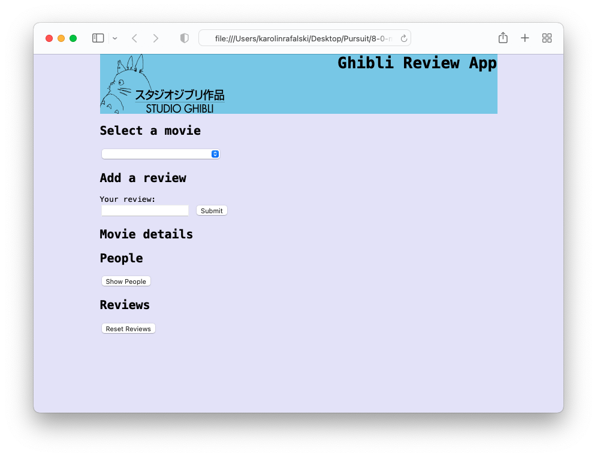
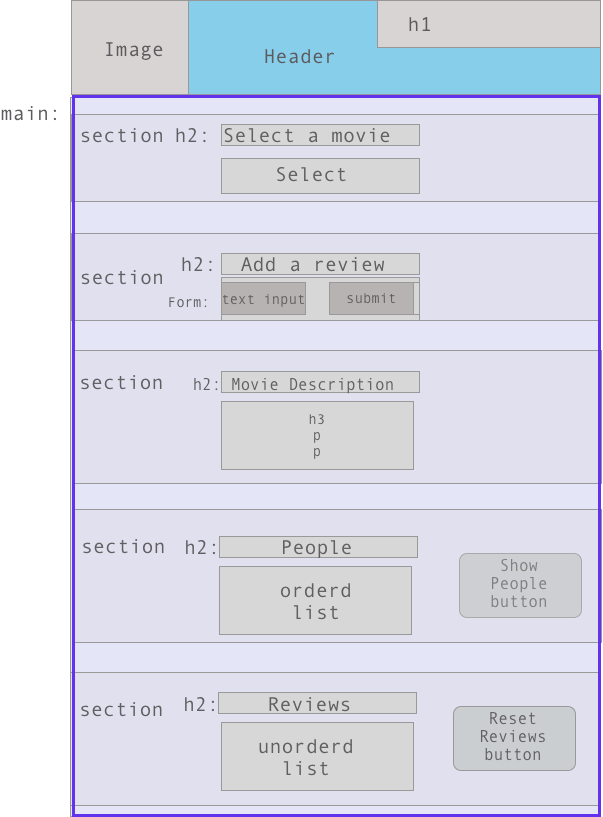
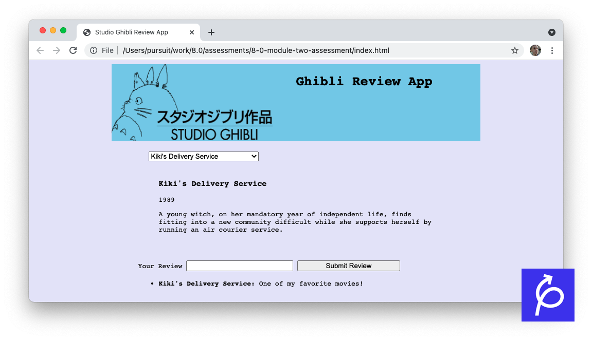
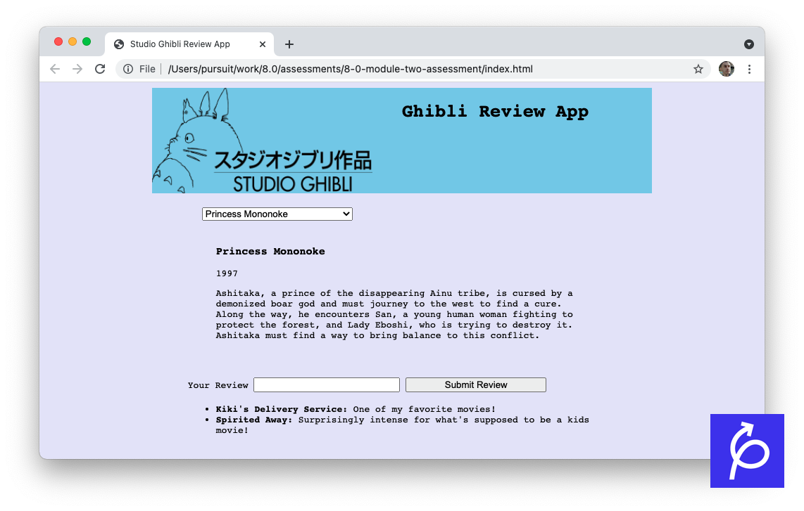
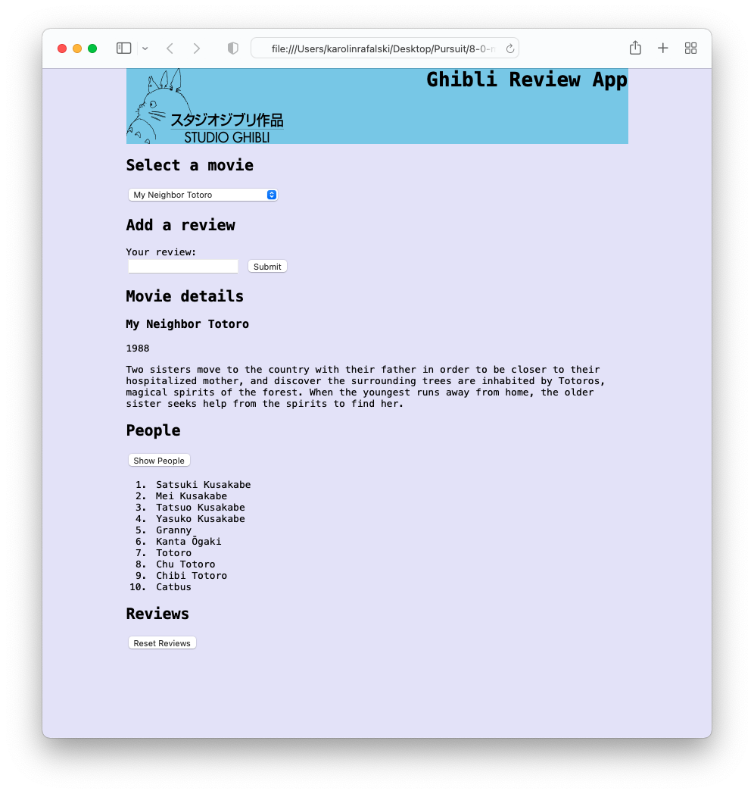

# Module Two Assessment

This challenge is designed to assess the HTML, CSS, and JavaScript skills you have gained so far.

There are 7 features that need to be created. Each completed feature (passes all the tests) will be worth 1 point.

A minium of 5 points must be attained in order to pass this assessment.

You may receive partial credit (0.5 points) for code that is close to passing the tests, but does not pass all the tests.

## Assessment Setup

### Getting started

1. Fork and clone this repository.

1. Navigate to the cloned repository's directory on your command line. Then, run the following command:

```
npm install
```

This will install the libraries needed to run the tests.

1. Open up the repository in VSCode. Follow the instructions below to complete the Lab.

### Tests

To run the tests, you can run the following command from the command line. You will need to be in the root directory of your local directory.

```
npm test
```

This will open the Cypress testing window, where you can click to run an individual suite of tests or all of the tests at once.

## Submitting

To submit the assessment, you should do the following:

- [ ] Create a pull request against the original repository.
- In your pull request description, add screenshots of the following:
  - [ ] Your landing page, when a user first arrives.
  - [ ] Your landing page, after choosing a dropdown menu.
  - [ ] Your landing page, after submitting two reviews.
- [ ] Submit a link to your pull request on Canvas.

## Assessment Details

You will create an application using HTML, CSS, and JavaScript that accesses the Studio Ghibli API and allows users to review each movie that was made by the studio.

### The API

The API can be accessed via the link below.

- [Studio Ghibli API](https://ghibliapi.herokuapp.com)

You will only need to make one API call in your application to receive all movies. Look under "Endpoints" to find the URL you will need to access.

### Initial Layout and Style



While it does not need to look exactly the same, it should include the following:

- [ ] `body`

  - [ ] The page's background should be the color `lavender`.
  - [ ] All non-input text should be of the font `monospace`.

- `header`

  - [ ] `img`: An image of the studio's logo should be in the header and should be the same height as the header. The image can be found in the `images/` folder
  - [ ] `h1`: `Ghibli Review App`
  - [ ] `header`: takes up about 75% of the page's width
  - [ ] The `header`'s background should be `skyblue`

- [ ] `main`

  - [ ] `section`
    - [ ] `h2`: `Select a movie`
    - [ ] `select` `id` `titles`: starts with one `option` (blank, no value), remaining `option`s will be populated with the movie titles from the API
  - [ ] `section`
  - [ ] `h2`: `Add a review`
    - [ ] `form`
      - [ ] `label`, `for` = `review`: `Your review`
      - [ ] `input`, `id` = `review`: type text
      - [ ] `input`: type submit
  - [ ] `section`

    - [ ] `h2`: `Movie details`
    - [ ] `div`, `id` = `display-info`: starts empty, will be populated with `h3` and two `p` elements, when a movie is selected

  - [ ] `section`
    - [ ] `h2`: `People`
    - [ ] `ol`: starts empty, will be populated with
      - [ ] `li` as people `names` are added
    - `button`, `id` = `show-people`, text `Show People`
  - [ ] `section`, `id` = `reviews`
    - [ ] `h2`: `Reviews`
    - [ ] `ul`: starts empty, will be populated with `li` as reviews are added
    - [ ] `button`, `id` = `reset-reviews`, text `Reset Reviews`

You can use this low-fidelity wire-frame to guide your HTML



### Select Menu

The movie titles should be populated into `option` elements from a call to the API inside the select menu.

`option` elements should have a `value `of the movie `id` and the text should be the movie `title`.

The first option should be blank, with no `value` and no text (see first image).


### Movie Description

This content should change each time the user choose a new option in the dropdown list.

When a movie is selected through one of the options from the dropdown list, the user should see:

An `h3` with the movie's title appear in the display-info section of the page.
A `p` with the movie's release year.
A `p` with the description of the movie.

This content should change each time the user choose a new option in the dropdown list.


### Add Reviews

- When the user enters their review into the text input and presses the "Submit Review" button, they should see:

  - [ ] The review, inside of an `unordered `list of `li` elements, with the name of the movie in a `strong` element and the text of the review afterwards.
  - [ ] The review text should be cleared from the text input.

  

- [ ] If the user selects a different dropdown option after making the review, all of the reviews should stay where they are.
      

- [ ] If the user tries to make a review when no movie is selected, an alert saying `Please select a movie first`, should appear

### Responsive Design

Update your page so that when the screen size is small, the Reviews section of the page disappears.

- [ ] `#reviews` should have a display of `block` if the viewport width is greater than 500px and a display of `none` if the viewport is less than or equal to 500px.

### Reset Reviews

A button with an `id` of `reset-reviews`, when clicked should empty the `ul` where the reviews were being populated.

### Get People for Movie

When the `Show People` button is clicked, it should generate an `ordered` list of people names associated with the movie.



<details><summary>Hint</summary>

Look at the `/people` endpoint of the API.

You want to select the people who have the same movie `id` as the selected `movie`.

</details>

### Commit history

Make sure to commit often after specific features are complete. Use sensible commit messages.
